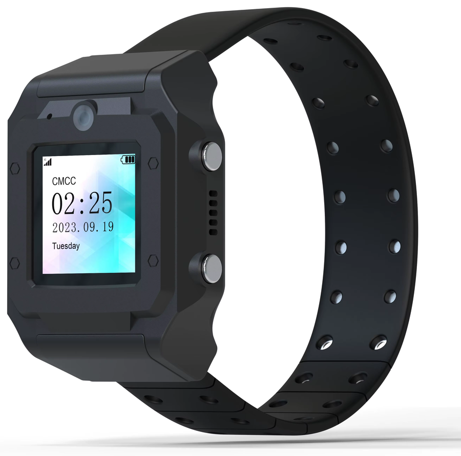

# pt880 root

Root for the ThinkRace inmate tracker — a Unisoc **SL8521E** wrist-worn tracking
device (`sp9820e_1h10` / `sl8521e_1h10ll_watch_native`, Android 4.4.4).

Tooling to dump, patch and reflash it, so you get adb and a root shell on
hardware you own.



The two buttons on the right edge are the entire input surface — there is no
working touchscreen. That shapes everything in
[apps/watchlauncher](apps/watchlauncher).

Read [NOTES.md](NOTES.md) first — it documents the verification chain, every
patch offset, and the dead ends worth not repeating.

## The launcher

The watch's own software - map and offline navigation, music, camera, calls,
bluetooth pairing and a root shell, in one application - now lives in its own
repository:

**https://github.com/no-body-in-particular/pt880-launcher**

It is attached here as a submodule at `apps/watchlauncher`, so:

    git clone --recursive https://github.com/no-body-in-particular/pt880-root.git

or, in a clone that already exists:

    git submodule update --init

It was split out with its history intact rather than copied, so `git log` in
that repository goes back to the first version of the launcher.

## Status

| Goal | State |
|---|---|
| Dump all partitions | working |
| Write any partition | working |
| Bootchain unlock (permanent, no PC at boot) | working |
| Boot a modified boot image | working |
| adb over USB | working |
| **root shell over adb** | **working** — uid 0 with a full capability set |
| `/system` writable at runtime | working |
| busybox / htop / nano / dropbear / sshfs installed | working |
| Bluetooth audio (A2DP) out to headphones | working |
| Music player running on the watch | working |
| Launcher, camera, dialler and terminal on the watch | working |
| Root shell inside an app (setuid helper) | working |

## Layout

    tools/       flashing stack and image builders
    fdl/         donor FDL1/FDL2 + CVE-2022-38694 payloads
    firmware/    byte-exact stock dumps of the bootchain (restore sources)
    scripts/     driver scripts (backup / build / flash / restore / fetch)
    analysis/    scratch space for disassembly work
    system/      files as they exist on the device under /system
    protocol/    what the tracker app speaks to its server, and the
                 documentation gap - see protocol/README.md
    apps/        apps built to run on the watch itself

`tools/` also holds the ext4 reader/writer (`ext4tool.py`, `ext4mod.py`) used
to edit `system.img` offline, so no device-side remount is needed to build an
image.

Full stock and patched firmware images are hosted outside git — see
[firmware/DOWNLOADS.md](firmware/DOWNLOADS.md), or fetch and verify them with
`./scripts/fetch-firmware.sh`.

`firmware/stock/` holds the small, irreplaceable partitions. `system.img`
(450 MB), `vendor.img` and the modem/DSP images are **not** committed — dump
them yourself with `scripts/backup.sh`, which writes them alongside. Nor is
`miscdata.img`: it carries this unit's serial number in plaintext and a donor
copy is wrong for any other device, so it is dumped per-device alongside
`prodnv` and `l_fixnv1`.

### apps/

`apps/watchlauncher/` replaces the stock launcher — a dead-end clock face with
no app list — and carries five apps inside one APK: **music**, **Bluetooth
pairing**, **camera**, **calls** and a **root terminal**. One activity, a screen
stack, and the clock and battery across the top of every screen. It ships a
57,858-entry IEEE vendor database so a Bluetooth scan names devices that will
not name themselves, and a 40-line setuid helper (`native/wsu.c`) that gets an
app a root shell — the adbd patch below does nothing for apps, which are forked
from zygote rather than from adbd. Read
[its README](apps/watchlauncher/README.md).

`apps/watchplayer/` is the music player on its own, and is what the root shell
was originally for: local files to A2DP headphones, driven by the two hardware
buttons. The launcher supersedes it and contains it; it is kept because it is
the smaller thing to read, and [its README](apps/watchplayer/README.md)
documents the firmware's distinctly odd key handling and the keylayout remap
that **both** apps depend on.

Neither uses Gradle — API 19 fights modern AGP, so `build.sh` drives the SDK
tools directly. Do not run both at once: they would fight over the headphones'
media buttons.

## Requirements

- Python 3 with `capstone` (`pip install capstone`)
- MinGW gcc (32-bit) and a 32-bit libusb import library, to build `spd_dump_cve.exe`
- A USB cable able to pull the ID pin to GND, to enter boot ROM mode
- `adb` (platform-tools) for the post-boot steps

### Workspace

The image builders read and write a scratch directory that is deliberately not
in the repo — partition dumps, stock FDL blobs and the Alpine armhf tree are
far too big for it. It defaults to `~/wpull`:

    ~/wpull/
        dump_watch2/    partition images read from and written to the device
        fdl_sl8521e/    stock and patched FDL1/FDL2 blobs
        tools_arm/      armhf binaries staged into system.img
            alpine/     unpacked Alpine rootfs they are taken from

Set `PT880_WORKSPACE` to move all of it at once. `tools/paths.py` is the single
place this is defined.

## Quick start

Build the flashing tool once:

```bash
./scripts/build_tools.sh
```

Dump the device (read-only, safe — repeat until it catches the boot ROM window):

```bash
./scripts/backup.sh ./firmware/mydevice
```

Build a rooted boot image from **your own** dump:

```bash
./scripts/build.sh ./firmware/mydevice
```

The image that gives a genuine root shell is built by
`tools/build_boot_capbnd.py`. It neuters adbd's three privilege-drop syscall
stubs *and* disables the capability-bounding-set drop with a one-byte edit, so
`adb shell` lands as uid 0 with `CapBnd=3fffffffff` and can remount `/system`
itself. `tools/build_boot_root.py` is the earlier version — uid 0 but
`CapBnd=0xc0`, so no remount. See NOTES.md section 6.

Customise `/system` offline (busybox aliases, colour prompt, `xterm-256color`,
`/etc/resolv.conf`, setuid busybox) and install the extra tools:

```bash
python tools/install_tools.py
python tools/customize_shell.py
```

Flash the unlock (bootchain + boot image):

```bash
./scripts/flash.sh ./firmware/mydevice
```

Put the watch in boot ROM mode (ID to GND, then power on) whenever a script says
it is armed. The supervisor re-arms automatically, so keep retrying.

Restore to stock at any time:

```bash
./scripts/restore.sh ./firmware/mydevice
```

## Safety

- **Always dump before writing.** `prodnv`, `l_fixnv1` and `miscdata` hold IMEI
  and per-unit calibration; no donor image can replace them.
- Download mode lives in mask ROM and is always reachable, so a bad write is
  recoverable as long as you have the stock dumps. This has been exercised many
  times.
- Never use `partition_list` with this FDL2 — it answers `0xFE`
  (unsupported) and aborts the session before the trailing `reset`, stranding
  the chip. Partition names must come from the vendor XML.
- `written: N` from spd_dump means nothing on its own. Every script here reads
  the partition back and compares hashes.

## Credits

- `spd_dump` by ilyakurdyukov; TomKing062 for the CVE-2022-38694 research and
  the `custom_exec_no_verify` payloads.
- `tools/spd_dump_cve.c` adds three things to upstream: a fix for
  `load_partition()` discarding its receive result, USB endpoint-stall
  recovery, and an `exec_addr` command implementing CVE-2022-38694.

## Legal

For use on hardware you own. Bootloader unlocking will void warranties and can
brick a device.
